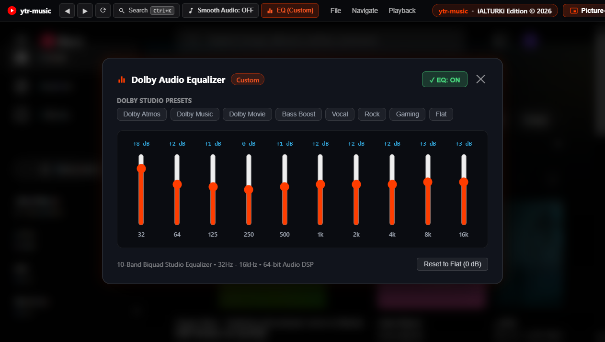

# ytr-music

🎵 A blisteringly fast, 100% ad-free desktop music client for Windows, built on a pure C++ Win32 engine with a 10-band studio equalizer, Web Audio smooth transitions, and an interactive glass miniplayer. One self-contained 680 KB exe, zero clutter, no ads.

[](https://github.com/iAlturki/ytr-music/releases/latest/download/ytr-music.exe)
[](https://github.com/iAlturki/ytr-music/actions/workflows/build.yml)


| Clean Ad-Free Player | 10-Band Studio Equalizer | Desktop Miniplayer | Native Speed |
|:-:|:-:|:-:|:-:|
|  |  |  |  |

## What's new in 4.2: performance first

Measured on Windows 11 with the WebView2 154 runtime, music streaming with the EQ on. CPU is the whole process tree (host + all WebView2 processes), as a percentage of one core over 20 s.

| State | 4.1 | 4.2 |
|---|---:|---:|
| Hidden in the tray, playing | 24.0 % | **6.8 %** (−72 %) |
| Hidden in the tray, paused | 10.3 % | **0.8 %** (−92 %) |
| Window visible, playing | 13.4 % | 12.7 % |
| Executable size | 1.56 MB | **0.68 MB** (−56 %) |

- **The page sleeps when you can't see it** – Once the window is in the tray or minimized, WebView2 is told the page is hidden and stops rendering (GPU work drops by ~95 %), while audio keeps playing. A paused, hidden page also moves to WebView2's low-memory mode.
- **No polling** – Ad handling, the top bar and the now-playing state are all event driven. Nothing in the page runs on a timer while paused.
- **Audio engine on demand** – The Web Audio graph is created on the first play, suspends itself a few seconds after you pause, and bypasses the EQ filters entirely when the EQ is off or flat.
- **Idle miniplayer costs nothing** – No timers while hidden, animation only during transitions, cached drawing resources, artwork fetched off the UI thread.
- **Safer by default** – Release builds no longer expose a DevTools debugging port; it only opens with `--debug`.
- **Sturdier** – Recovers from WebView2 crashes, the tray icon and taskbar buttons survive Explorer restarts, a clean shutdown order, and DPI-aware windows.

See [CHANGELOG.md](CHANGELOG.md) for the full list.

## Features

- **Pure Native Speed** – Modern C++17 on the Windows WebView2 Evergreen runtime. Single statically linked exe with the WebView2 loader and page bridge embedded.
- **100% Ad-Free Audio Engine** – In-player JSON payload pruner, network ad-domain blocker and instant ad skipper. Zero audio ads, zero video ads, zero interruptions.
- **10-Band Studio Equalizer** – Adjustable bands from `32Hz` to `16kHz` (-12dB to +12dB) with live dB readouts, a master toggle and presets: `Spatial`, `Studio`, `Cinema`, `Bass Boost`, `Vocal`, `Rock`, `Gaming` and `Flat`. Fully bypassed when off or flat.
- **Smooth Fades** – Perceptual fade-out and fade-in on pause, resume and skip, from YouTube Music's own buttons, media keys, the tray and the miniplayer. Choose Quick (0.25 s), Smooth (0.5 s) or Long (1 s) in the Audio panel.
- **Clean Top Bar** – Back/forward, search (`Ctrl + K`), now playing, one Audio button for the equalizer and fades, the miniplayer button and a compact menu.
- **Glass Acrylic Miniplayer** – Right-docked widget above the taskbar with album art, animated EQ bars, seek scrubber, speaker mute toggle, volume slider and wheel volume.
- **Global Hotkeys & Media Keys**
  - `Ctrl + Alt + M` – Toggle the desktop miniplayer
  - `Ctrl + Alt + E` – Open the Audio panel (equalizer and smooth fades)
  - `Ctrl + Alt + Space` / `Media Play/Pause` – Play / Pause
  - `Ctrl + Alt + Right` / `Media Next` – Next track
  - `Ctrl + Alt + Left` / `Media Prev` – Previous track
  - `Mouse Wheel` over the miniplayer – Volume in 5 % steps
  - `Click or Drag` on the miniplayer sliders – Volume / seek
- **System Tray & Taskbar** – Close to tray, live song tooltip, and play/pause/next/previous buttons in the taskbar thumbnail.

## Quick Start

### Portable run (no installation)
1. Download **[`ytr-music.exe`](https://github.com/iAlturki/ytr-music/releases/latest/download/ytr-music.exe)** from the latest release.
2. Run `ytr-music.exe`, or double-click **`Run-Native.bat`**.

Requires Windows 10 or 11 with the Microsoft Edge WebView2 Runtime (preinstalled on Windows 11).

### Command-line options

| Option | Effect |
|---|---|
| `--miniplayer` | Start with only the miniplayer visible |
| `--debug` | Enable DevTools (port 9222 on 127.0.0.1) and write `%APPDATA%\ytr-music-native\debug.log` |

### Building from source

Requires [MinGW-w64](https://www.mingw-w64.org/) (UCRT, GCC 13 or newer) on `PATH`.

```powershell
git clone https://github.com/iAlturki/ytr-music.git
cd ytr-music

cmd.exe /c native\build.bat           # optimized release build -> native\bin\ytr-music.exe
cmd.exe /c native\build.bat debug     # unoptimized build with symbols
```

The version lives in `native/res/version.h`. Every push is built by the CI workflow, which uploads the exe as an artifact.

## Project layout

```
native/
  src/main.cpp              process entry, hotkeys, power/memory policy
  src/main_window.cpp       main window, visibility, DPI
  src/webview_engine.cpp    WebView2 host, ad filter, page <-> host messages
  src/bridge.js             page script: ad blocking, top bar, EQ, state reporter
  src/miniplayer.cpp        layered GDI+ desktop miniplayer
  src/tray.cpp              system tray icon and menu
  src/taskbar_controls.cpp  taskbar thumbnail buttons
  res/                      icon, manifest, version info, resource script
  build.bat                 build script
```

## Author & License

- **Creator & Sole Rights Holder**: **[iALTURKi](https://github.com/iALTURKi)**
- **Repository**: [github.com/iAlturki/ytr-music](https://github.com/iAlturki/ytr-music)
- **License**: MIT License (see [license](license)).
- **Security**: see [SECURITY.md](SECURITY.md).
