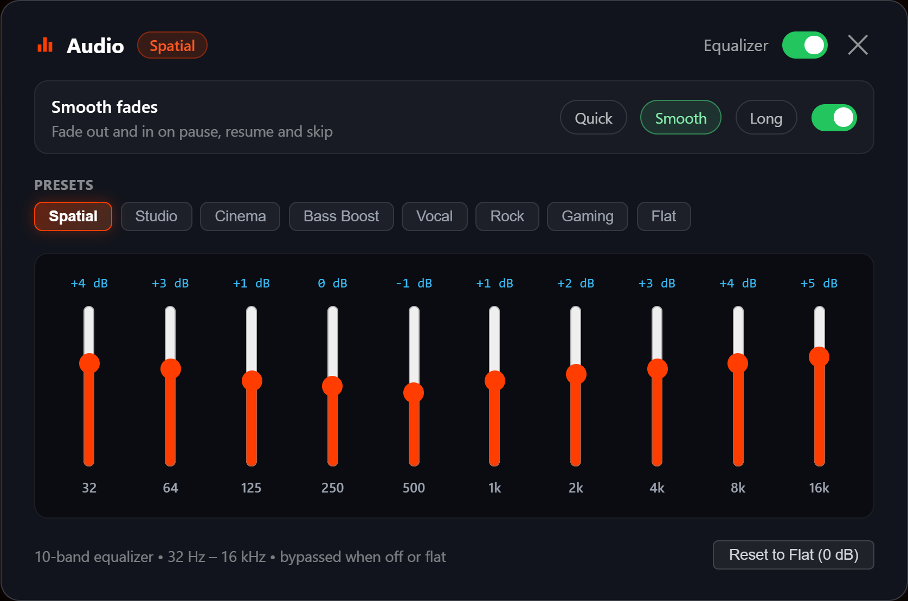
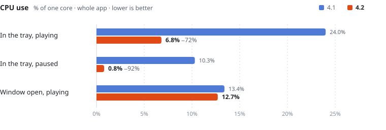

<div align="center">


# ytr-music

**YouTube Music for Windows. Ad-free, native, quiet.**

[](https://github.com/iAlturki/ytr-music/releases/latest/download/ytr-music.exe)
[](https://github.com/iAlturki/ytr-music/actions/workflows/build.yml)


[](license)

<br>


<br><br>

<table>
<tr>
<td align="center" width="25%">🚫<br><b>No ads</b><br><sub>audio or video</sub></td>
<td align="center" width="25%">🎚️<br><b>10-band EQ</b><br><sub>8 presets</sub></td>
<td align="center" width="25%">🌊<br><b>Smooth fades</b><br><sub>0.25 · 0.5 · 1 s</sub></td>
<td align="center" width="25%">🪟<br><b>Miniplayer</b><br><sub>above the taskbar</sub></td>
</tr>
<tr>
<td align="center">🪶<br><b>690 KB</b><br><sub>one portable exe</sub></td>
<td align="center">💤<br><b>0.8 % CPU</b><br><sub>paused in the tray</sub></td>
<td align="center">⌨️<br><b>Media keys</b><br><sub>global hotkeys</sub></td>
<td align="center">🔒<br><b>No debug port</b><br><sub>unless <code>--debug</code></sub></td>
</tr>
</table>

</div>

<br>

<p align="center">
  
</p>

<br>

<picture>
  <source media="(prefers-color-scheme: dark)" srcset="assets/perf-dark.svg">
  
</picture>

<br>

| | Shortcut |
|:--|:--|
| ⏯️ Play / pause | <kbd>Space</kbd> · <kbd>Ctrl</kbd> <kbd>Alt</kbd> <kbd>Space</kbd> · media key |
| ⏭️ Next / ⏮️ previous | <kbd>Ctrl</kbd> <kbd>Alt</kbd> <kbd>→</kbd> / <kbd>←</kbd> · media keys |
| 🔍 Search | <kbd>Ctrl</kbd> <kbd>K</kbd> · <kbd>/</kbd> |
| 🎚️ Audio panel | <kbd>Ctrl</kbd> <kbd>Alt</kbd> <kbd>E</kbd> |
| 🪟 Miniplayer | <kbd>Ctrl</kbd> <kbd>Alt</kbd> <kbd>M</kbd> |
| 🔊 Volume | mouse wheel over the miniplayer |

<br>

<div align="center">

### [⬇️ Download ytr-music.exe](https://github.com/iAlturki/ytr-music/releases/latest/download/ytr-music.exe)

<sub>Run it. No installer. Needs the WebView2 Runtime (built into Windows 11).</sub>

</div>

<details>
<summary><b>Build from source</b></summary>

<br>

MinGW-w64 (UCRT, GCC 13+) on `PATH`, then:

```powershell
git clone https://github.com/iAlturki/ytr-music.git
native\build.bat            # release  -> native\bin\ytr-music.exe
native\build.bat debug      # symbols; run with --debug for DevTools + log
```

| Flag | |
|:--|:--|
| `--miniplayer` | start with only the miniplayer |
| `--debug` | DevTools on `127.0.0.1:9222`, log in `%APPDATA%\ytr-music-native` |

</details>

<br>

<p align="center">
<sub>
<a href="CHANGELOG.md">Changelog</a> · <a href="SECURITY.md">Security</a> · <a href="license">MIT License</a>
<br>
Made by <a href="https://github.com/iAlturki"><b>iALTURKi</b></a>
</sub>
</p>
